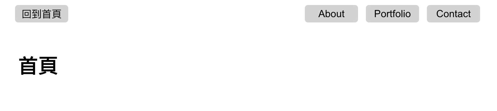

# 我的 Express 基礎驗收專案

用 Express 製作的簡單網頁應用




## Features 功能
- 有 4 個頁面：首頁、About、Portfolio、Contact
- 點擊導覽列的按鈕時可前往對應頁面
- 各頁面內容為一行標題文字

## Prerequisites 環境建置與需求
- Node.js 14.16.0
- Express 4.16.4
- Express handlebars 3.0.0
- Bootstrap 5.1.3
- Font-awesome 5.8.1

## Installation and execution 安裝與執行

1. 請先確認有安裝 node.js 與 npm
2. 將專案 clone 到本地
3. 在本地開啟之後，透過終端機進入資料夾，輸入：

   ```bash
   npm install
   ```

4. 安裝完畢後，繼續輸入：

   ```bash
   npm run dev
   ```

5. 若看見此行訊息則代表順利運行，打開瀏覽器進入到以下網址

   ```bash
   Listening on http://localhost:3000
   ```

6. 若欲暫停使用

   ```bash
   ctrl + c
   ```